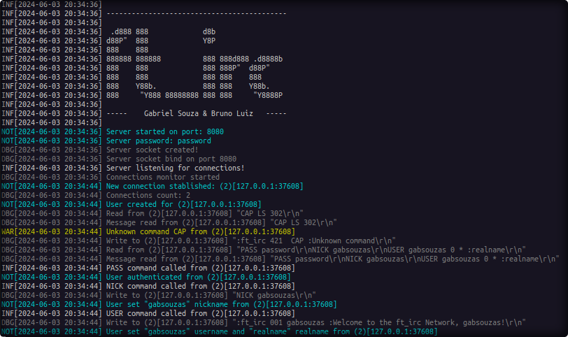

# 42-ft_irc

An implementation of an IRC (Internet Relay Chat) server in C++98. This project is part of the 42 school curriculum and focuses on network programming, non-blocking I/O, and the IRC protocol.



## Overview

`ft_irc` is a multi-client IRC server that allows users to connect, join channels, and exchange messages in real-time. The server is built using standard C++98 and handles multiple simultaneous connections without using threads (relying on I/O multiplexing).

### Key Features

- **Multi-client support**: Handles multiple connections concurrently.
- **Channel Management**: Create, join, part, and manage channels.
- **Operator Privileges**: Channel operators can kick, invite, and change channel modes.
- **Real-time Messaging**: Private messages and channel-wide broadcasts.
- **Standard Protocol**: Compatible with standard IRC clients.

## Getting Started

### Prerequisites

- A C++ compiler (g++) supporting C++98.
- `make` build tool.
- [Google Test](https://github.com/google/googletest) (required only for running the test suite).

### Compilation

To compile the server, run:

```bash
make
```

This will generate the `ircserv` executable.

### Running the Server

Launch the server by specifying a port and a password:

```bash
./ircserv <port> <password>
```

Example:
```bash
./ircserv 6667 my_secure_password
```

## How IRC Works

Internet Relay Chat (IRC) is a text-based communication protocol that follows a **client-server architecture**. 

1. **Connection**: Clients connect to a central server using a TCP/IP socket.
2. **Messages**: Communication consists of lines of text ending with `\r\n`. Each line is either a **command** (from client to server) or a **reply** (identifiable by a 3-digit numeric code from server to client).
3. **State Management**: The server keeps track of connected users and active channels. Messages sent to a channel are broadcast to all users joined to that channel.
4. **Asynchronous**: IRC handles multiple events simultaneously—users joining, leaving, and messaging—without requiring synchronous waiting.

## Server Password

Security is a crucial part of server management. `ft_irc` requires a password at startup for two main reasons:

- **Access Control**: Only users who know the server password can successfully authenticate and register their presence on the network.
- **Protocol Compliance**: According to the IRC protocol, the `PASS` command must be sent before the `NICK` and `USER` commands during the initial connection handshake. If the password provided by the client doesn't match the one specified at server startup, the registration process will be aborted.

## Command Usage Guide

To interact with the server, you can use a standard IRC client or a simple tool like `nc` (netcat). Below is a guide on how to perform common tasks.

### 1. Connecting and Registering

Before you can join channels or send messages, you must register your session:

```bash
PASS server_password
NICK my_nickname
USER username 0 * :Real Name
```

> [!NOTE]
> In this implementation, you **must** send `PASS` first if the server was started with a password.

### 2. Channels

- **Join a channel**: `JOIN #example`
- **Leave a channel**: `PART #example`
- **Change topic**: `TOPIC #example :New amazing topic`
- **Invite someone**: `INVITE other_user #example`

### 3. Messaging

- **Private Message**: `PRIVMSG target_user :Hello there!`
- **Channel Message**: `PRIVMSG #example :Hello everyone!`

### 4. Operator Actions

If you are a channel operator (usually the person who created the channel), you can:

- **Kick a user**: `KICK #example annoying_user :optional reason`
- **Change modes**: `MODE #example +i` (set invite-only)

---

## Implemented Commands

The server implements a subset of the [RFC 2812](https://datatracker.ietf.org/doc/html/rfc2812) protocol.

| Command | Description | RFC Reference |
| :--- | :--- | :--- |
| **PASS** | Sets a connection password. | [Section 3.1.1](https://datatracker.ietf.org/doc/html/rfc2812#section-3.1.1) |
| **NICK** | Gives the user a nickname or changes the existing one. | [Section 3.1.2](https://datatracker.ietf.org/doc/html/rfc2812#section-3.1.2) |
| **USER** | Specifies the username, hostname, and realname for a user. | [Section 3.1.3](https://datatracker.ietf.org/doc/html/rfc2812#section-3.1.3) |
| **JOIN** | Join a specific channel. | [Section 3.2.1](https://datatracker.ietf.org/doc/html/rfc2812#section-3.2.1) |
| **PART** | Leave a specific channel. | [Section 3.2.2](https://datatracker.ietf.org/doc/html/rfc2812#section-3.2.2) |
| **PRIVMSG** | Send a private message to a user or a channel. | [Section 3.3.1](https://datatracker.ietf.org/doc/html/rfc2812#section-3.3.1) |
| **QUIT** | Terminates the client session. | [Section 3.1.7](https://datatracker.ietf.org/doc/html/rfc2812#section-3.1.7) |
| **KICK** | Eject a user from a channel (Operator only). | [Section 3.2.8](https://datatracker.ietf.org/doc/html/rfc2812#section-3.2.8) |
| **INVITE** | Invite a user to a channel. | [Section 3.2.7](https://datatracker.ietf.org/doc/html/rfc2812#section-3.2.7) |
| **TOPIC** | Change or view the channel topic. | [Section 3.2.4](https://datatracker.ietf.org/doc/html/rfc2812#section-3.2.4) |
| **MODE** | Change channel or user modes. | [Section 3.1.5](https://datatracker.ietf.org/doc/html/rfc2812#section-3.1.5) |

### Debug Commands

The following commands are implemented for internal debugging and server monitoring:

- `@USERS`: Lists all users currently connected to the server.
- `@CHANNELS`: Lists all active channels and their properties.

## Testing

The project includes a comprehensive test suite using Google Test. To run the tests, use the following commands:

1. **Install dependencies** (if not already installed):
   ```bash
   make test-install
   ```

2. **Run tests**:
   ```bash
   make test-run
   ```

3. **Run tests with Valgrind** (to check for memory leaks):
   ```bash
   make test-run-val
   ```